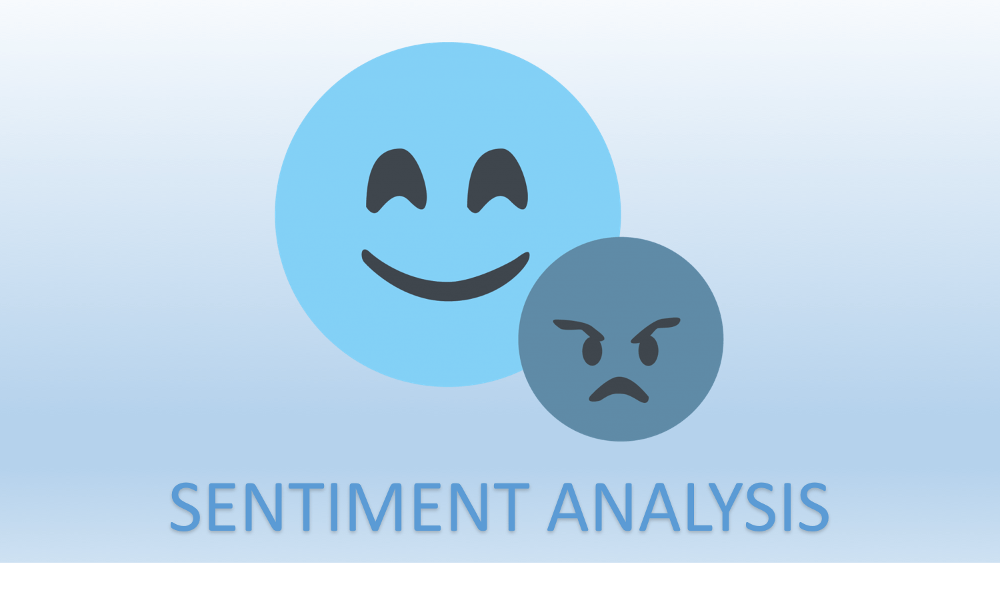

# IMDB Sentiment Analysis

This repository contains the 'imdb sentiment analysis' project of the Udacity's [Artificial Intelligence Nanodegree](https://www.udacity.com/course/artificial-intelligence-nanodegree--nd889).



## Project Overview
In this project, a dataset from [IMDB](http://www.imdb.com/) will be used to train a Multilayer Perceptron Network (MLP) to predict the sentiment analysis of a review.

## The datased
This lab uses a dataset of 25,000 IMDB reviews. Each review, comes with a label. A label of 0 is given to a negative review, and a label of 1 is given to a positive review. The goal of this lab is to create a model that will predict the sentiment of a review, based on the words on it. You can see more information about this dataset in the Keras website.

Now, the input already comes preprocessed for us for convenience. Each review is encoded as a sequence of indexes, corresponding to the words in the review. The words are ordered by frequency, so the integer 1 corresponds to the most frequent word ("the"), the integer 2 to the second most frequent word, etc. By convention, the integer 0 corresponds to unknown words.

## Install

 1. Obtain the necessary Python packages, and switch Keras backend to Tensorflow.

	For __Mac/OSX__:
	```
		conda env create -f requirements/aind-dl-mac.yml
		source activate aind-dl
		KERAS_BACKEND=tensorflow python -c "from keras import backend"
	```

	For __Windows__:
	```
		conda env create -f requirements/aind-dl-windows.yml
		activate aind-dl
		set KERAS_BACKEND=tensorflow
		python -c "from keras import backend"
	```

	For __Linux__:
	```
		conda env create -f requirements/aind-dl-linux.yml
		source activate aind-dl
		KERAS_BACKEND=tensorflow python -c "from keras import backend"
	```

 2. Run jupyter notebook
 	```
		source activate aind-dl
		. start.sh
	```

 3. Enjoy!

