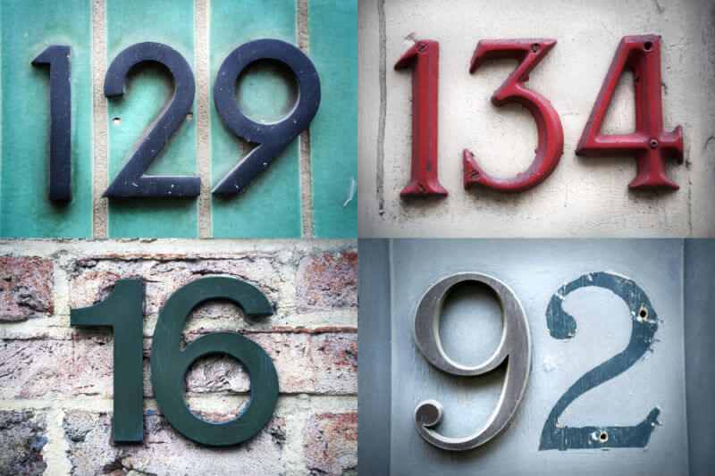

# Street View House Numbers

This repository contains the 'street view house numbers' project of the Udacity's [Artificial Intelligence Nanodegree](https://www.udacity.com/course/artificial-intelligence-nanodegree--nd889).

## Project Overview
In this project it will be built a DCGAN to generate street view house number images.

## Install

 1. Download the necessary Python modules:
> pip install -r requirements.txt
 2. Open the notebook:
> jupyter street-view-house-numbers-dcgan.ipynb

I hope you enjoy it!
